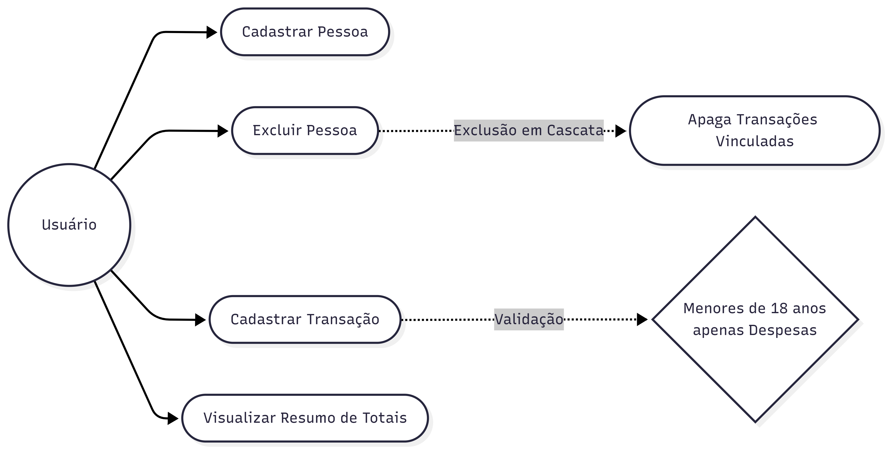
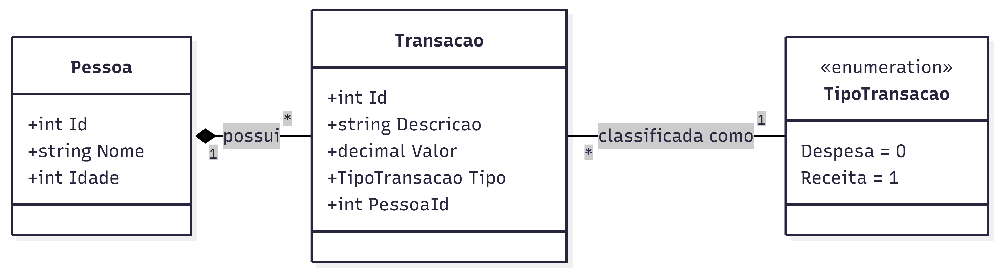

# Documentação do Projeto

Este diretório reúne os artefatos de análise e design do **Controle de Gastos**.

## Estrutura

```
documentacao/
├── README.md                  # este arquivo (índice)
├── enunciado.md                # especificação original do desafio técnico
└── diagramas/
    ├── casos-de-uso.png                        # imagem renderizada
    ├── casos-de-uso.mmd                         # código-fonte (Mermaid)
    ├── diagrama-de-classes.png                  # imagem renderizada
    ├── diagrama-de-classes.mmd                  # código-fonte (Mermaid)
    ├── diagrama-de-sequencia-cadastro-transacao.mmd   # fluxo de cadastro + validação de idade
    └── diagrama-de-sequencia-exclusao-pessoa.mmd       # fluxo de exclusão em cascata
```

A ideia de manter o `.mmd` (texto) ao lado do `.png` (imagem) é que o diagrama fique
**versionável como código**: qualquer alteração de modelo passa a ser revisada em um
`git diff` legível, em vez de depender de reabrir uma ferramenta gráfica.

## Diagramas

### 1. Casos de Uso

Mostra as interações do usuário com o sistema e as duas regras de negócio centrais
(exclusão em cascata e restrição de receita para menores de idade) como
comportamentos incluídos (`«include»`) nos respectivos casos de uso.



### 2. Diagrama de Classes

Representa o modelo de domínio: `Pessoa` (1) possui (0..*) `Transacao`, e cada
`Transacao` é classificada por `TipoTransacao` (enum `Receita = 0`, `Despesa = 1`,
conforme definido em [`Models/Transacao.cs`](../Models/Transacao.cs)).



### 3. Diagramas de Sequência

Detalham, passo a passo, os dois fluxos com regras de negócio (os únicos que têm
lógica condicional relevante — as demais operações são CRUD simples):

- **Cadastro de Transação**: valida se a pessoa existe e, se for menor de 18 anos,
  bloqueia o cadastro de receitas.
- **Exclusão de Pessoa**: remove a pessoa e demonstra o `OnDelete(DeleteBehavior.Cascade)`
  configurado em [`Data/AppDbContext.cs`](../Data/AppDbContext.cs), que apaga as
  transações vinculadas.

Ainda não há imagem gerada para esses dois — veja abaixo como gerar.

## Como visualizar/editar os diagramas

Os arquivos `.mmd` usam a sintaxe [Mermaid](https://mermaid.js.org/). Algumas opções:

1. **Mermaid Live Editor**: cole o conteúdo do `.mmd` em <https://mermaid.live> e
   exporte como PNG/SVG.
2. **Extensão do VS Code/Cursor**: instale "Markdown Preview Mermaid Support" ou
   "Mermaid Chart" para visualizar e exportar diretamente no editor.
3. **CLI (`mermaid-cli`)**, útil para regenerar os PNGs automaticamente:

   ```bash
   npm install -g @mermaid-js/mermaid-cli
   mmdc -i diagramas/casos-de-uso.mmd -o diagramas/casos-de-uso.png
   ```

## Convenção de nomenclatura

Todos os arquivos usam `kebab-case` sem acentos, para evitar problemas de
compatibilidade entre sistemas de arquivos (Windows/Linux) e URLs.
